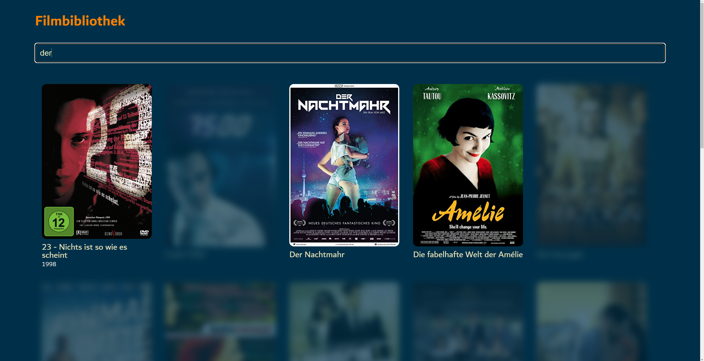
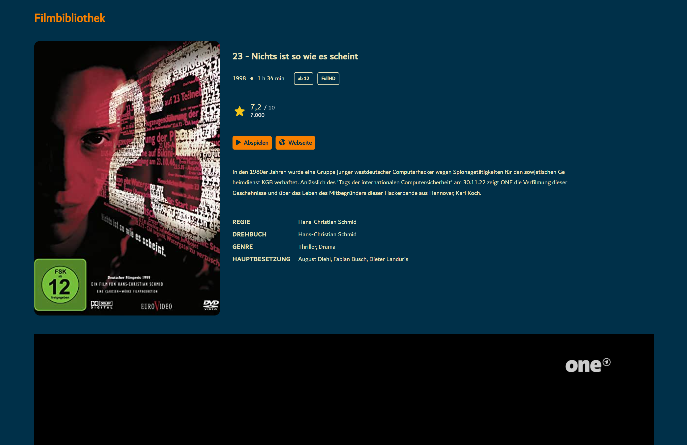

# Filmbibliothek

&nbsp;
&nbsp;
&nbsp;
&nbsp;
<!-- &nbsp; -->

## [Release: v0.4.0](https://github.com/FabianBartl/Filmbibliothek/releases/tag/v0.4.0)

- Provides an installation script: [install.py](install.py)
- Operates with *Flask* backend and can be reached in the browser at http://filmbibliothek/ or http://localhost/ or from another device in the same network
- Scrapes all movie information from IMDb and user-defined YAML files

<!-- ### Known issues -->

### Changes

- Added `metadata-directories` configuration to specify the location of metadata and movie configuration files.
- Added `accessible-in-network` configuration to be able to access the website within your local network using the IP address of your host device
- Added `website`, `camera`, `studio`, `subtitles`, `scrape-additional-data` and `imdb-id` attributes as possible movie configuration
- Renamed movie configuration attribute `author` to `writer`
- Almost all possible movie data are now queried from IMDb
- Subtitle support added
- Allow only URLs or relative paths for attributes of movie configurations that require paths 

### Patch notes

- Responsive CSS style for smartphones and tablets added
- Added fallback (google) fonts
- Ignore the `non-result filters` configuration on smaller screens and show only the search results instead
- Fix `ModuleNotFoundError` error when running the [install.py](install.py) script for the first time
- Show the IMDb rating on the movie details page
- The [collect_metadata.py](collect_metadata.py) script now has a colored progress bar representing the level of the last logging message  

### Impressions

#### Movie overview


`http://filmbibliothek/`

Here are listed all movies contained in the configured movie directories:

```yml
# directories of movies and related metadata files
# possible strings: [absolute path]
# (multiple values possible)
movie-directories:
  - N:\\Videos\\Filme-Sammlung_1
  - N:\\Videos\\Filme-Sammlung_2
```

#### Search functionality


`http://filmbibliothek/?query=Thriller`

Configured filters are applied to movies that are not included in the search results. These filters can be set with the `not-result-filters` setting in the [config.yml](config.yml) file:

```yml
# filters that are applied to movie elements not included in the search results
# possible strings: unclickable, hidden, blurred, grayed, darkened, inverted, faded, cleared
# (multiple values possible)
not-result-filters:
  - blurred
  - faded
  - unclickable
```

Run [collect_metadata.py](collect_metadata.py) to update the listed movies and their data stored in [static/data/movies.json](static/data/movies.json), if you have added movies or changed user-defined metadata files.

#### Movie page


`http://filmbibliothek/movie/1/`

The movie will be streamed from the local directory and played on the same tab.

Most movie attributes can be set in an user-defined YAML file, named like `[MOVIE NAME].yml`. This file must be located in the corresponding metadata directory specified in the [config.yml](config.yml) file as `metadata-directories`:

```yml
# directories to search for associated metadata files of the movies
# possible strings: [absolute path]
# note: must be in the same order as the 'movie-directories' entries
#       e.g. the first directory of the 'metadata-directories' contains the metadata yaml files for the movies in the first directory of the 'movie-directories'
# (multiple values allowed)
metadata-directories:
  - N:\\Videos\\Filme-Sammlung_1\\data
  - N:\\Videos\\Filme-Sammlung_2
```

Example for an user-defined YAML file:

*Here: The movie file `23.mp4` is located at `N:\\Videos\\Filme-Sammlung-1` and the corresponding `23.yml` file is located at `N:\\Videos\\Filme-Sammlung-1\\data`*

```yml
# must be an url or a relative path
poster: https://m.media-amazon.com/images/M/MV5BN2Y3NmQ5NGQtMjYwYi00ZDA5LThhZDYtN2FkZGZlNTA5MmY1L2ltYWdlL2ltYWdlXkEyXkFqcGdeQXVyMzA3Njg4MzY@._V1_QL75_UY562_CR9

# must be a string
age-rating: FSK 12
title: 23 - Nichts ist so wie es scheint
# should be an integer
year: 1998

# must be a list of strings or a single string
director: Hans-Christian Schmid
writer:
  - Michael Gutmann
  - Hans-Christian Schmid
  - Michael Dierking
genre:
  - Thriller
  - Drama
main-cast:
  - August Diehl
  - Fabian Busch
  - Dieter Landuris
studio: Studio XY
camera: Max Mustermann

# must be an url or a relative path
# only WebVTT format is supported
subtitles:
  de: 23_de.vtt
  en: 23_en.vtt

# must be a string
# here with multiline syntax
description: |
  In den 1980er Jahren wurde eine Gruppe junger westdeutscher
  Computerhacker wegen Spionagetätigkeiten für den sowjetischen
  Geheimdienst KGB verhaftet. Anlässlich des 'Tags der
  internationalen Computersicherheit' am 30.11.22 zeigt ONE die
  Verfilmung dieser Geschehnisse und über das Leben des
  Mitbegründers dieser Hackerbande aus Hannover, Karl Koch.

# must be a boolean
scrape-additional-data: true

# must be a string
# should be an imdb movie id
imdb-id: tt0126765

# must be an url
website: https://www.imdb.com/title/tt0126765/
```

*All these attributes are optional and allmost all attributes are scraped by the [collect_metadata.py](collect_metadata.py) script, but the user-defined values override them.*

*The attribute `imdb-id` should only be set if the wrong movie is listed. If the `scrape-additional-data` attribute is set to `false`, only the user-defined attributes are displayed and no additional information is collected from imdb. The default value is `true`.*

The description can also be read from a metadata file created by the movie download tool [MediadiathekView](https://mediathekview.de/):

```
Sender:      ARD
Thema:       Filme

Titel:       23 - Nichts ist so wie es scheint

Datum:       28.11.2022
Zeit:        20:15:00
Dauer:       01:34:44
Größe:       2,6 GiB

Website
https://www.ardmediathek.de/video/Y3JpZDovL3dkci5kZS9CZWl0cmFnLWQwMjU4ZDVlLTFlODUtNDAxNS05OTM1LTAzMDJhZjBkZDlhZg

URL
https://wdrmedien-a.akamaihd.net/medp/ondemand/de/fsk12/283/2830609/2830609_49100337.mp4

In den 1980er Jahren wurde eine Gruppe junger westdeutscher
Computerhacker wegen Spionagetätigkeiten für den sowjetischen
Geheimdienst KGB verhaftet. Anlässlich des 'Tags der
internationalen Computersicherheit' am 30.11.22 zeigt ONE die
Verfilmung dieser Geschehnisse und über das Leben des
Mitbegründers dieser Hackerbande aus Hannover, Karl Koch.
```
