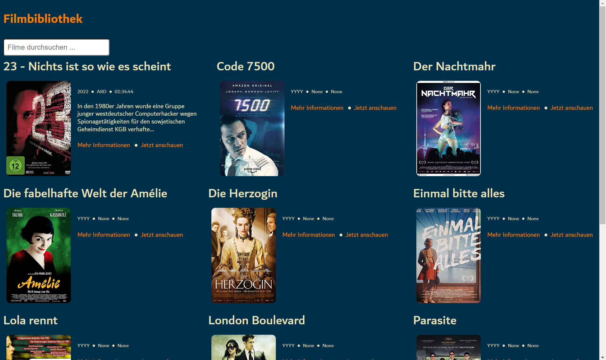

# Filmbibliothek

## Release: v0.1.0

- Basic concept is working
- Own modern designed webpage
- Provides an installation script for Windows
- Operates with *Flask* backend and can be accessed in the browser at http://filmbibliothek/

Known issues:
- Shifted CSS grid
- Sometimes wrong scraped movie posters
- Most movie data incomplete
