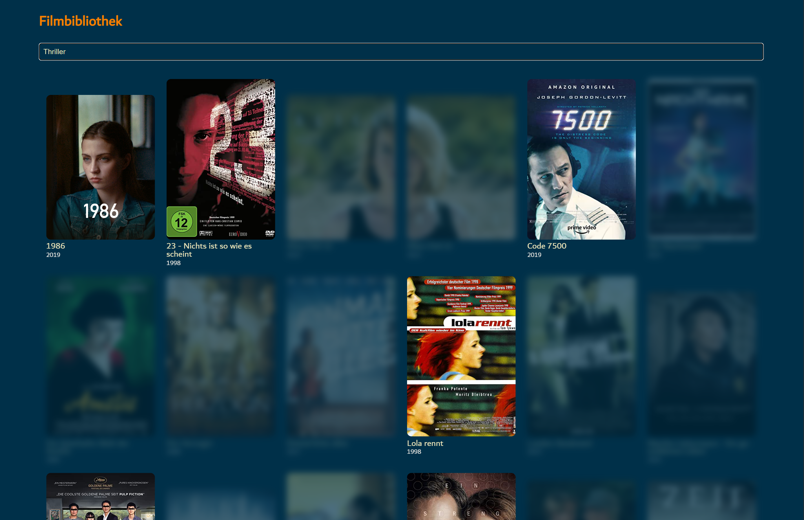

# Filmbibliothek

&nbsp;
&nbsp;
&nbsp;
&nbsp;
<!-- &nbsp; -->

## [Release: v0.3.0](https://github.com/FabianBartl/Filmbibliothek/releases/tag/v0.3.0)

- Own modern designed webpage
- Provides an installation script for Windows: [install-win.py](install-win.py)
- Operates with *Flask* backend and can be reached in the browser at http://filmbibliothek/ or http://localhost/ or from another device in the same network
- Scrapes movie information from IMDB and user-defined YAML files

### Known issues

- Sometimes wrong scraped movie posters
- Scraped movie data incomplete (currently only movie posters are being scraped)
- Only German UI available

<!-- ### Patch notes -->

### Changes

- New config option `metadata-directories` to specify separate location of metadata files
- Allow relative paths inside user-defined YAML files
- Config option `server-host` to `server-name` renamed
- Added config options `accessible-in-network` and `log-level` 

### Impressions

#### Movie overview


`http://filmbibliothek/`

Here are listed all movies contained in the configured movie directories:

```yml
# directories of movies and related metadata files
# possible strings: [absolute path]
# (multiple values possible)
movie-directories:
  - N:\\Videos\\Filme-Sammlung_1
  - N:\\Videos\\Filme-Sammlung_2
```

#### Search functionality


`http://filmbibliothek/?query=der`

Configured filters are applied to movies that are not included in the search results. These filters can be set with the `not-result-filters` setting in the [config.yml](config.yml) file:

```yml
# filters that are applied to movie elements not included in the search results
# possible strings: unclickable, hidden, blurred, grayed, darkened, inverted, faded, cleared
# (multiple values possible)
not-result-filters:
  - blurred
  - faded
  - unclickable
```

Run [collect_metadata.py](collect_metadata.py) to update the listed movies and their data stored in [static/data/movies.json](static/data/movies.json) if you have added movies or changed user-defined metadata files.

#### Movie page


`http://filmbibliothek/movie/0/`

The `poster`, `year`, `age-rating`, `description`, `director`, `author`, `genre` and the `main-cast` attribute can be set in the user-defined `[MOVIE NAME].yml` file. This file must be located in the same directory as the video file.

```yml
poster: https://m.media-amazon.com/images/M/MV5BN2Y3NmQ5NGQtMjYwYi00ZDA5LThhZDYtN2FkZGZlNTA5MmY1L2ltYWdlL2ltYWdlXkEyXkFqcGdeQXVyMzA3Njg4MzY@._V1_QL75_UY562_CR9
age-rating: FSK 12
year: 1998

# can be a list or a single string:
director: Hans-Christian Schmid
author:
  - Michael Gutmann
  - Hans-Christian Schmid
  - Michael Dierking
genre:
  - Thriller
  - Drama
main-cast:
  - August Diehl
  - Fabian Busch
  - Dieter Landuris
```

In this case, the description is not defined in the YAML file, but read from a metadata file created by the movie download tool [MediadiathekView](https://mediathekview.de/):

```
Sender:      ARD
Thema:       Filme

Titel:       23 - Nichts ist so wie es scheint

Datum:       28.11.2022
Zeit:        20:15:00
Dauer:       01:34:44
Größe:       2,6 GiB

Website
https://www.ardmediathek.de/video/Y3JpZDovL3dkci5kZS9CZWl0cmFnLWQwMjU4ZDVlLTFlODUtNDAxNS05OTM1LTAzMDJhZjBkZDlhZg

URL
https://wdrmedien-a.akamaihd.net/medp/ondemand/de/fsk12/283/2830609/2830609_49100337.mp4

In den 1980er Jahren wurde eine Gruppe junger westdeutscher
Computerhacker wegen Spionagetätigkeiten für den sowjetischen
Geheimdienst KGB verhaftet. Anlässlich des 'Tags der
internationalen Computersicherheit' am 30.11.22 zeigt ONE die
Verfilmung dieser Geschehnisse und über das Leben des
Mitbegründers dieser Hackerbande aus Hannover, Karl Koch.
```

*All these attributes are optional.*

The movie will be streamed from the local directory and played on the same tab.
